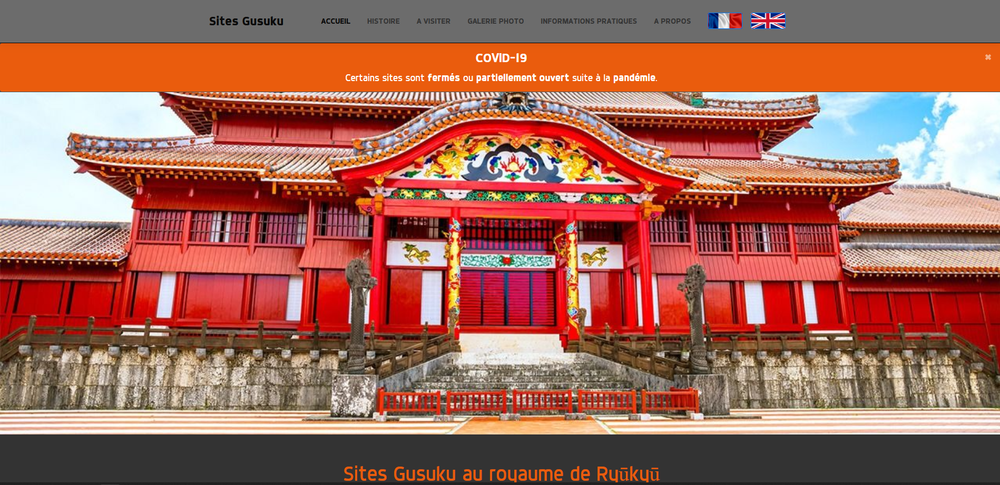

# sites-gusuku-unesco
Création d'un site web en partenariat avec l'UNESCO pour promouvoir un patrimoine classé

#### [Lien du site (https://alexandre.laplaige.fr/projets/unesco)](https://alexandre.laplaige.fr/projets/unesco)




 #### Récupérer le projet
```
git clone https://github.com/Zecrum/sites-gusuku-unesco
cd sites-gusuku-unesco
```


 ###### Copyright @Zecrum